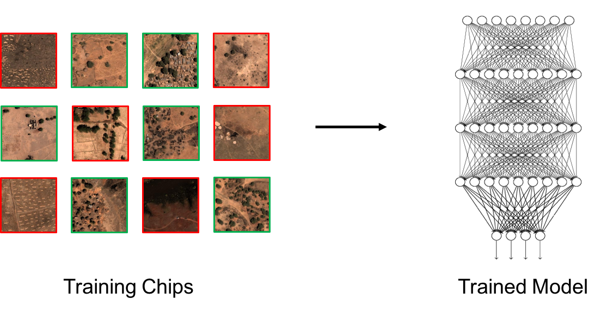

# train-cnn-chip-classifier

A GBDX task that takes GeoTiff image chips created from the [chip-from-vrt](https://github.com/PlatformStories/chip-from-vrt) task and produces a trained Convolutional Neural Network (CNN) classifier. The network architecture is [VGG Net](https://arxiv.org/pdf/1409.1556.pdf), which was developed as part of the [2014 ImageNet](http://www.image-net.org/challenges/LSVRC/2014/) challenge.




## Run

Here we execute an example in which a classifier is trained to find buildings in Nigeria from image chips stored on S3. Note that there is also a geojson 'ref.geojson' in this location with class names ('No Buildings' or 'Buildings') for each chip, which will be used to train the network. The chips and reference geojson are all outputs of the [chip-from-vrt](https://github.com/PlatformStories/chip-from-vrt) task.

1. In a Python terminal create a GBDX interface and specify the task input location:

    ```python
    from gbdxtools import Interface
    from os.path import join
    import uuid

    gbdx = Interface()

    input_location = 's3://gbd-customer-data/58600248-2927-4523-b44b-5fec3d278c09/platform-stories/train-cnn-chip-classifier/'
    ```

2. Create a task instance and set the required inputs:  

    ```python
    train_task = gbdx.Task('train-cnn-chip-classifier')
    train_task.inputs.chips = join(input_location, 'chips')
    train_task.inputs.classes = 'No Buildings, Buildings'
    train_task.inputs.max_side_dim = '270'
    train_task.inputs.resize_dim = '150'
    ```

3. Set any optional hyper-parameters if necessary. With the following parameters training should take about four hours to complete:

    ```python
    train_task.inputs.two_rounds = 'False'
    train_task.inputs.nb_epoch = '50'
    train_task.inputs.train_size = '2500'
    train_task.inputs.test_size = '2000'
    train_task.inputs.bit_depth = '8'
    ```

4. Initialize a workflow and specify where to save the output:

    ```python
    train_wf = gbdx.Workflow([train_task])
    random_str = str(uuid.uuid4())
    output_location = join('platform-stories/trial-runs', random_str)

    train_wf.savedata(train_task.outputs.trained_model, join(output_location, 'trained_model'))
    ```

5. Execute the workflow:  

    ```python
    train_wf.execute()
    ```

6. Track the status of the workflow as follows:

    ```python
    train_wf.status
    ```


## Input Ports  

The task input ports. Note that booleans, integers and floats **must be** passed to the task as strings, e.g., 'True', '10', '0.001'.

| Name  | Type | Description:                                      | Required |
|-------|---------|--------------|---------------------------------------------------|
| chips | Directory | Contains GeoTiff image chips (feature_id.tif) produced from chips-s3-imagery. Should also contain a geojson 'ref.geojson' with class names for each chip (referenced by feature id). | True |
| classes  | String | Classes to train network on, each separated by a comma (e.g- 'No Buildings, Buildings'). Must be exactly as they appear in the class_name property of the geojson used to create the chips in the chip-from-vrt task. | True |
| [min_side_dim](#side-dimensions) | String | The minimum acceptable side dimension (in pixels) for training chips. Defaults to 0. | False |
| [max_side_dim](#side-dimensions)  | String | The maximum acceptable side dimension (in pixels) for training chips. Defaults to 150. | False |
| [resize_dim](#resize_dim) | String | Dimension to resize the chip side dimensions to. This should be smaller than the original dimension. Defaults to None | False |
| [two_rounds](#two_rounds) | String | If True, train the network in two rounds- first on balanced classes then on the original distribution of classes. In the second training round only the weights of the final layer of the model will be updated. Recommended if there is class imbalance in the dataset. Defaults to False | False |
| [train_size](#training-size) | String | Number of chips to train the network on for the first round of training. Defaults to 10000. | False |
| [train_size_2](#training-size)  | String | Number of chips to train on in the second round of training. Only relevant if two_rounds is True. Defaults to half of train_size | False |
| [batch_size](#batch-size)  | String | Number of chips to train on per batch. Defaults to 32 | False |
| [nb_epoch](#nb_epoch) | String | Number of training epochs to perform for the first round of training. Defaults to 35 | False |
| [nb_epoch_2](#nb_epoch) | String | Number of training epochs to perform for the second round of training. Only relevant if two_rounds is True. Defatults to 8. | False |
| [use_lowest_val_loss](#use_lowest_val_loss)  | String | After the first round of training use the model weights that yielded the lowest validation loss as the final model (recommended). Otherwise the model weights after the final epoch will be used. Defaults to True | False |
| [test](#testing)  | String | If True testing will be completed on a subset of chips. A test report with accuracy metrics will be saved as a text file in the 'model' output directory. Defaults to True. | False |
| [test_size](#testing)  | String | Number of chips to test on. Only relevant if test is True. Defaults to 1000. | False |
| [learning_rate](#learning-rate)  | String | Learning rate for the first round of training. Defaults to 0.001 | False |
| [learning_rate_2](#learning-rate)  | String | Learning rate for the second round of training (if applicable). Defaults to 0.01. | False |
| [bit_depth](#bit_depth)  | String | Bit depth of the image strips in images. This parameter is necessary for proper normalization. Defaults to 8. | False |
| [kernel_size](#kernel_size) | String | Side dimension (in pixels) of the kernels at each convolutional layer in the network. Defaults to 3. | False |
| small model | String | Use a model with 8 layers instead of 16. Useful for large input images (>250 pixels). Defaults to False. | False |


## Output Ports  

train-cnn-chip-classifier has one output directory port, trained_model, which is described below:

| Name  | Type | Description:                                      |
|-------|------|---------------------------------------------------|
| trained_model | Directory | The fully trained model saved as an h5 file. Models after all epochs will be saved in a subdirectory called model_weights, with the format epoch{n}_{validation_loss}.h5, where n is the epoch that produced the weights. This directory will also contain a test report, which will only have accuracy metrics if train is True. |

## Advanced  

This section contains additional information that provides further insight into training parameters and suggestions for training an effective model.


### two_rounds  

The two_rounds flag is a method for dealing with data that has natural class imbalance (unequal representation of image classes). Training a CNN on data with unbalanced classes often results in the network classifying all target data under the majority class. two_rounds avoids this by training in the following steps:
1. Train the network on balanced data (the task will take care of creating a balanced training dataset).  
2. Retrain the network on the original class distribution to account for the probability of encountering a given image class. This round will only update the weights to the output layer of the network.

    

This two-round training process allows the network to learn to distinguish between classes based on distinct features (round one) and then learn the probability of encountering each class (round two). This is highly recommended for data that is not balanced.

### side dimensions

Constraints on the minimum and maximum size (in pixels) of a chip. Side dimensions are based on the size of chips bounding box (white line below).


A sample input chip is displayed above. Note that CNNs require all train/test inputs to have identical dimensions. Thus, all chips are zero-padded to the following dimensions: (num_bands, max_side_dim, max_side_dim). If resize_dim is set, the chips will then be resized to (num_bands, resize_dim, resize_dim). This means that any chips that have a side dimension larger than max_side_dim will not be used during training.

### training size

Number of chips to train on. If not enough chips are provided the task will throw an error.

Notice that if training takes place in [two_rounds](#two-rounds), the maximum train size will be as follows: size of smallest class * number of classes, assuming that all chips are of valid size (as defined by min_side_dim and max_side_dim). Additionally if [testing](#testing) is performed the test data will be subtracted from the available training chips.

### batch size

Number of chips to train on per batch. The model weights will be updated following each batch. Smaller batch sizes can help avoid local minima by increasing the amount of noise in the gradient.

### nb_epoch

Number of training epochs to complete. The validation loss tends to decrease with each successive epoch until a minimum loss is reached. At this point any additional training epochs may result in overfitting.

### use_lowest_val_loss

While the validation loss of the model tends to decrease with successive training epochs, it rarely does so monotonically. Furthermore, if too many training epochs are completed the model may begin to overfit, causing the validation loss to increase with successive epochs. The loss may therefore not be at a minimum at the end of training. Use this flag to ensure that the initial round returns a model with the lowest possible validation loss.

Note that all model weights will be returned in the model_weights folder of the output directory.

### testing

Testing should only be done on two-class classifications. The following explanations assume the classes are input to the task as follows: 'Negative class, Positive class'.

If the test flag is set to True, the task will put aside a set of chips to get accuracy metrics for the trained model. Set this to False if you would like to complete testing manually.

The following metrics are provided in test results:
* Precision: True Positives / (True Positives + False Positives)
* Recall: True Positives / (True Positives + False Negatives)
* F1 score: (2 * Precision * Recall) / (Precision + Recall)

### kernel_size

Each convolutional layer of a CNN uses kernels to extract features from the input image to create an output feature map that is passed to the next layer. This parameter specifies the side dimension of these kernels to use to train the network. Note that increasing the kernel size will slow down training dramatically. Finding the ideal kernel size for a specific use case is often a matter of trial and error.

### resize_dim

There may be memory errors when the input chips are too large (over 250px). This argument will downsample the side dimension of input chips to the specified number of pixels.


## Development

### Build the Docker Image

You need to install [Docker](https://docs.docker.com/engine/installation/).

Clone the repository:

```bash
git clone https://github.com/platformstories/train-cnn-chip-classifier
```

Then:

```bash
cd train-cnn-chip-classifier
docker build -t yourusername/train-cnn-chip-classifier .
```

Then push the image to Docker Hub:

```bash
docker push yourusername/train-cnn-chip-classifier
```

The image name should be the same as the image name under containerDescriptors in train-cnn-chip-classifier.json.


### Register on GBDX

In a Python terminal:

```python
from gbdxtools import Interface
gbdx = Interface()
gbdx.task_registry.register(json_filename='train-cnn-chip-classifier.json')
